# Experimento cloud azure 

### Arquitetura da aplicação
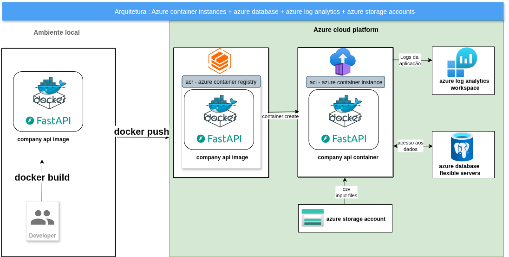


## Parte 1: Instalação e configuração do cli da azure no ubuntu

### Instalação do azure cli 

```bash
curl -sL https://aka.ms/InstallAzureCLIDeb | sudo bash 
```

```bash
az login
```

### Apos confirmar o seu login e senha no navegador e receber a confirmação de login com sucesso, será solicitado a escolha da sua subscription, na linha de comando,  confirme a sua subscription, ela provavelmente será a subscription numero 1 - Azure for students

### Utilize os comandos abaixo para verificar se a configuração do cli foi executada com exito.

```bash

az account list --output table
```

```bash
az account list-locations --output table
```

## Parte 2: Criação do grupo de recursos para o experimento

### O que é o grupo de recurso ?

Um grupo de recursos é um contêiner que contém recursos relacionados para uma solução Azure. O grupo de recursos pode incluir todos os recursos para a solução ou apenas os recursos que você deseja gerenciar como um grupo. Você decide como alocar recursos para grupos de recursos com base no que faz mais sentido para sua organização. Em geral, adicione recursos compartilhando o mesmo ciclo de vida ao mesmo grupo de recursos para que você possa implantá-los, atualizá-los e excluí-los facilmente como um grupo. Embora um grupo de recursos tenha uma localidade especifica, seus recursos podem estar em outras localidades.

### Criação do azure resource group via azure cli 

```bash

COMPANY_PG_SERVER_NAME=pgfacens01
COMPANY_RESOURCE_GROUP=rg-facens-bigdata
COMPANY_LOCATION=canadacentral
COMPANY_PG_USER=pgfacens
COMPANY_PG_PASSWORD=A12345678a
COMPANY_PG_BD_NAME=companydb
COMPANY_PG_PORT=5432
COMPANY_STORAGE_ACCOUNT_NAME=stfacensbigdatacompany
COMPANY_SHARE_NAME=companyshare
COMPANY_CONTAINER_REGISTRY_NAME=containerregistryfacensbigdata
COMPANY_ANALYTICS_WORKSPACE=awfacensbigdatacompany


az group create --name $COMPANY_RESOURCE_GROUP --location "$COMPANY_LOCATION" 

az group list --output table
```

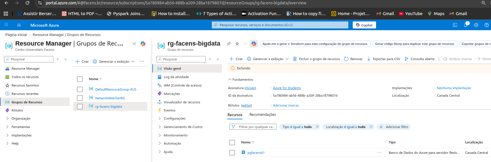

## Parte 3: Criação do banco de dados gerenciado - postgres

### O que é um banco de dados gerenciado ?

O Banco de Dados do Azure para PostgreSQL é um serviço de banco de dados totalmente gerenciado que oferece controle granular e flexibilidade sobre as funções de gerenciamento de banco de dados e as configurações. O serviço fornece personalizações de flexibilidade e configuração de servidor com base em seus requisitos. A arquitetura permite agrupar o mecanismo de banco de dados com a camada de cliente para menor latência e escolher alta disponibilidade em uma única zona de disponibilidade e em várias zonas de disponibilidade. A instância de servidor flexível do Banco de Dados do Azure para PostgreSQL também fornece controles de otimização de custo com a capacidade de parar e iniciar seu servidor e uma camada de computação intermitível ideal para cargas de trabalho que não precisam de capacidade de computação completa continuamente. O serviço dá suporte a várias versões principais da comunidade do PostgreSQL. Para obter detalhes sobre as versões específicas com suporte, consulte versões com suporte do PostgreSQL no Banco de Dados do Azure para PostgreSQL. O serviço está disponível em diferentes regiões do Azure.

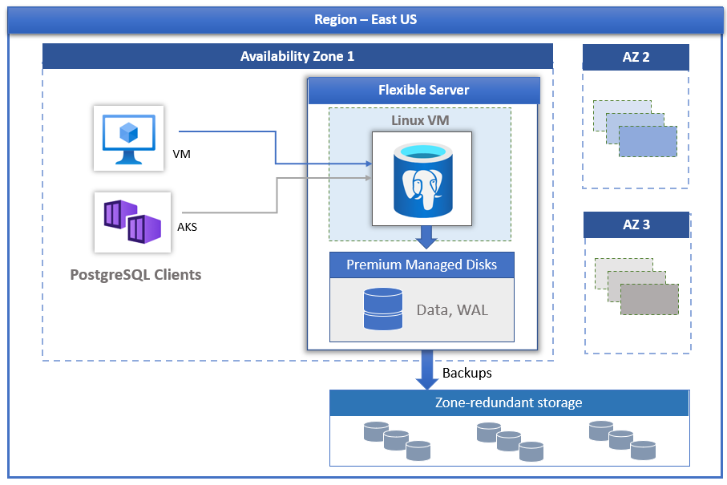

[Página de referência](https://learn.microsoft.com/pt-br/azure/postgresql/overview )


### Criação de uma instancia de banco de dados gerenciada no azure - postgres

```bash
az postgres flexible-server create \
  --name $COMPANY_PG_SERVER_NAME \
  --resource-group $COMPANY_RESOURCE_GROUP \
  --location $COMPANY_LOCATION \
  --admin-user $COMPANY_PG_USER \
  --admin-password $COMPANY_PG_PASSWORD \
  --sku-name Standard_B1ms \
  --tier Burstable \
  --storage-size 32 \
  --version 14 \
  --public-access 0.0.0.0
```

### Criando um novo banco de dados para a instancia gerenciada postgres

```bash
az postgres flexible-server db create \
  --resource-group $COMPANY_RESOURCE_GROUP \
  --server-name $COMPANY_PG_SERVER_NAME \
  --database-name $COMPANY_PG_BD_NAME
```

### Regra de firewall para acesso remoto a instancia gerenciada postgres

```bash
az postgres flexible-server firewall-rule create \
  --resource-group $COMPANY_RESOURCE_GROUP \
  --name $COMPANY_PG_SERVER_NAME \
  --rule-name allow-all \
  --start-ip-address 0.0.0.0 \
  --end-ip-address 255.255.255.255
```

### Regra de firewall para acesso remoto a instancia gerenciada postgres (essa regra será valida em maio/2026, nesse momento vai resultar em erro)

```bash
az postgres flexible-server firewall-rule create \
  --resource-group $COMPANY_RESOURCE_GROUP \
  --server-name $COMPANY_PG_SERVER_NAME \
  --name my-ip \
  --start-ip-address 0.0.0.0 \
  --end-ip-address 255.255.255.255  
```

### Instalação do cliente postgresql no ubuntu local, necessário para acesso remoto

```bash
sudo apt install postgresql-client-common
sudo apt update
sudo apt install postgresql-client
```

### Acessando a instancia gerenciada do postgres da máquina local

```bash
psql "host=$COMPANY_PG_SERVER_NAME.postgres.database.azure.com \
port=$COMPANY_PG_PORT \
dbname=$COMPANY_PG_BD_NAME \
user=$COMPANY_PG_USER \
password=$COMPANY_PG_PASSWORD \
sslmode=require"
```

```bash
select datname FROM pg_database;
```

### Para configurar o dbeaver e acessar a instancia postgres remotamente, acesse no menu do dbeaver
databases -> new database connection e preencha como na imagem.
No seu caso, ajuste conforme as modificações de nomes nas variáveis

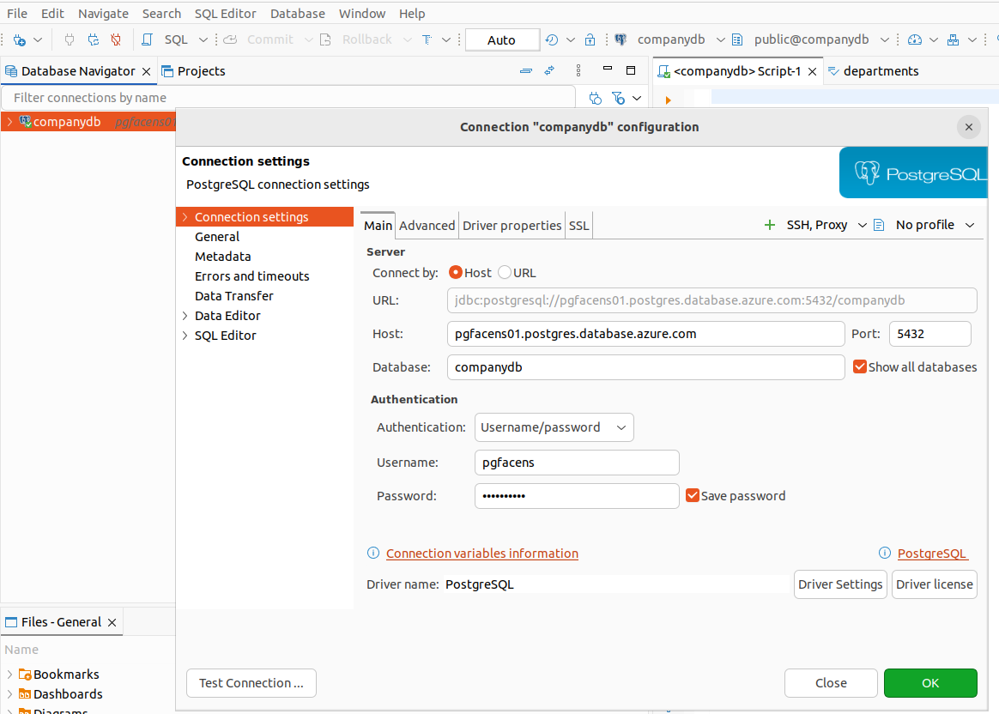

### Criando as tabelas na instancia gerenciada - postgres

Primeiro abra o script init.sql , dentro do diretório db.

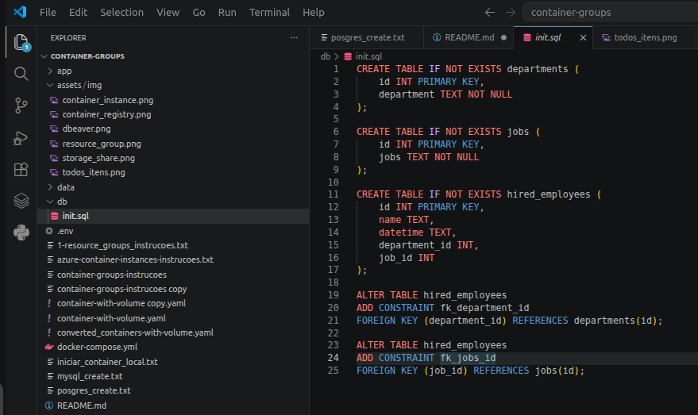

Copie o conteudo do script 
Abra do Dbeaver, clique direito do mouse sobre a conexão criada anteriormente
SQl Editor -> New SQL script
Cole todo o conteudo do script init.sql 
Selecione trecho por trencho indivialmente e clique no botão executar

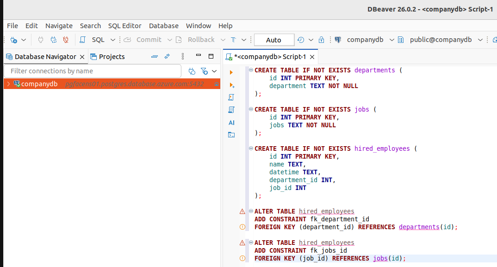

### Parando e reiniciando uma instancia gerenciada do postgre da máquina local

```bash
az postgres flexible-server stop --resource-group $COMPANY_RESOURCE_GROUP --name $COMPANY_PG_SERVER_NAME
```

```bash
az postgres flexible-server start --resource-group $COMPANY_RESOURCE_GROUP --name $COMPANY_PG_SERVER_NAME
```

## Parte 4: Criação do grupo de storage account para armazenamento de arquivos

### O que é o storage account  ?

O Azure Storage é um serviço de armazenamento em nuvem que oferece escalabilidade, durabilidade e alta disponibilidade para dados na nuvem. Ele é projetado para armazenar grandes volumes de dados de forma segura e acessível de qualquer lugar do mundo. O Azure Storage é composto por vários tipos de armazenamento, cada um otimizado para cenários específicos.

- Azure Blob Storage: Armazena dados não estruturados (imagens, vídeos, documentos, logs).
- Azure Files: Compartilhamentos de arquivos gerenciados (SMB/NFS).
- Azure Queues: Armazenamento de mensagens para processamento assíncrono.
- Azure Tables: Armazenamento NoSQL de chave-valor para dados estruturados.

Segurança: Todos os dados são criptografados em repouso.
Redundância: Oferece opções como LRS (local), ZRS (zona), GRS (geo) para garantir que os dados não sejam perdidos.

### Criar uma storage account e um file share 

```bash
az storage account create \
    --name $COMPANY_STORAGE_ACCOUNT_NAME \
    --resource-group $COMPANY_RESOURCE_GROUP \
    --location $COMPANY_LOCATION \
    --sku Standard_LRS
```

### Consultando a chave de acesso do storage account criando uma variável com o valor da chave  

```bash
STORAGE_KEY=$(az storage account keys list \
    --account-name $COMPANY_STORAGE_ACCOUNT_NAME \
    --resource-group $COMPANY_RESOURCE_GROUP \
    --query "[0].value" \
    --output tsv)
```
### Criando file share no storage account 
```bash
az storage share create \
    --name $COMPANY_SHARE_NAME \
    --account-name $COMPANY_STORAGE_ACCOUNT_NAME \
    --account-key $STORAGE_KEY \
    --quota 10
```
### Criando um diretório no file share 
```bash
az storage directory create \
  --account-name $COMPANY_STORAGE_ACCOUNT_NAME \
  --account-key $STORAGE_KEY \
  --share-name $COMPANY_SHARE_NAME \
  --name files
```
### Copiando os arquivos locais para o diretŕio do file share , no storage account
```bash
az storage file upload-batch \
  --account-name $COMPANY_STORAGE_ACCOUNT_NAME \
  --account-key $STORAGE_KEY \
  --destination $COMPANY_SHARE_NAME \
  --source ./data \
  --destination-path files
```

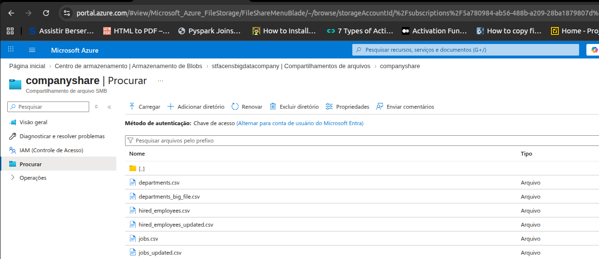


## Parte 5: Criação do container registry e implantando uma imagem de container salvar no container registry

### O que é o acr - azure container registry ?

O ACR - Azure Container Registry é o serviço de containers da Azure, para armazenar, gerenciar e implantar imagens de container Docker no ambiente azure, 
de forma segura e escalável

### O que é o aci - azure container instances ?

O ACI - Azure Container Instances é a solução azure para implantar containers na infraestrutura da Azure, oferencendo suporte para containers Linux e Windows,
sem a necessidade de provisionar máquinas virtuais , discos , etc.
Compativel com diversos tipos de serviços de registro de containers

### Criar novo registro de container na azure 

```bash
az acr create --resource-group $COMPANY_RESOURCE_GROUP \
 --name $COMPANY_CONTAINER_REGISTRY_NAME --sku Basic
```

### logar no novo acr - registro de container na azure 

```bash
az acr login --name $COMPANY_CONTAINER_REGISTRY_NAME 
```

az acr show --name $COMPANY_CONTAINER_REGISTRY_NAME  --query loginServer --output table


### É necessário  para habilitar o acesso admin , para poder usar as variaveis username e secret abaixo #############
az acr update -n $COMPANY_CONTAINER_REGISTRY_NAME --admin-enabled true

### Construindo a imagem localmente 

```bash
cd app
docker build -t company-api:latest .
```

### Tageando a imagem baixada com uma diferente Tag
```bash
docker tag company-api:latest containerregistryfacensbigdata.azurecr.io/company/company-api:latest
```

### Push na nova imagem tageada localmente para o container registry
```bash
docker push containerregistryfacensbigdata.azurecr.io/company/company-api:latest
```

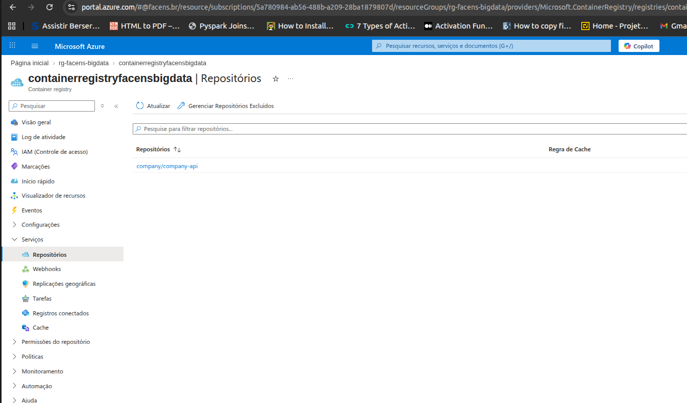


## Parte 6: Criação  criando um log analytics workspace para verificar logs e erros 

### O que é o azure log analytics workspace ?

Um Workspace do Log Analytics é um repositório de dados no qual você pode coletar qualquer tipo de dado de log de todos os seus recursos e aplicativos do Azure e não Azure. As opções de configuração do espaço de trabalho permitem que você gerencie todos os seus dados de log em um único espaço de trabalho para atender às necessidades de operações, análise e auditoria de diferentes personas em sua organização por meio de:

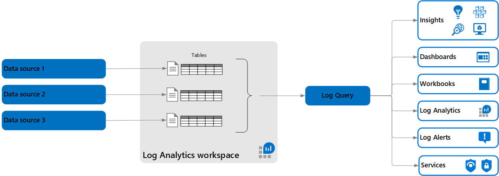


[Página de referência](https://learn.microsoft.com/pt-br/azure/azure-monitor/logs/log-analytics-workspace-overview.png )

### Criando o log analytics workspace

```bash
az monitor log-analytics workspace create --resource-group $COMPANY_RESOURCE_GROUP \
      --workspace-name $COMPANY_ANALYTICS_WORKSPACE
```

### Exibindo o log analytics criado
```bash
az monitor log-analytics workspace show \
  --resource-group $COMPANY_RESOURCE_GROUP \
  --workspace-name $COMPANY_ANALYTICS_WORKSPACE \
  --query customerId \
  -o tsv
```

### Exibindo os a chaves de acesso ao  log analytics criado
```bash
az monitor log-analytics workspace get-shared-keys \
  --resource-group $COMPANY_RESOURCE_GROUP \
  --workspace-name $COMPANY_ANALYTICS_WORKSPACE
```

### Extraindo as chaves de acesso e workspace id do  log analytics criado para variaveis
```bash
WORKSPACE_ID=$(az monitor log-analytics workspace show \
  --resource-group $COMPANY_RESOURCE_GROUP \
  --workspace-name $COMPANY_ANALYTICS_WORKSPACE \
  --query customerId \
  -o tsv)

WORKSPACE_KEY=$(az monitor log-analytics workspace get-shared-keys \
  --resource-group $COMPANY_RESOURCE_GROUP \
  --workspace-name $COMPANY_ANALYTICS_WORKSPACE \
  --query primarySharedKey \
  -o tsv)
```

## Parte 7: Criando uma aci - azure container instance com a imagem salva no acr - azure container registry

O que é o azure analytics workspace ?


### Variaveis para a criação do azure container instance

```bash
ACR_USERNAME=$(az acr credential show \
  --name $COMPANY_CONTAINER_REGISTRY_NAME \
  --query username -o tsv)

ACR_PASSWORD=$(az acr credential show \
  --name $COMPANY_CONTAINER_REGISTRY_NAME \
  --query "passwords[0].value" -o tsv)

STORAGE_KEY=$(az storage account keys list \
    --account-name $COMPANY_STORAGE_ACCOUNT_NAME \
    --resource-group $COMPANY_RESOURCE_GROUP \
    --query "[0].value" \
    --output tsv)
```

```bash
export STORAGE_KEY=$STORAGE_KEY
export COMPANY_PG_SERVER_NAME=pgfacens01
export COMPANY_PG_USER=pgfacens
export COMPANY_PG_PASSWORD=A12345678a
export COMPANY_PG_BD_NAME=companydb
export COMPANY_PG_PORT=5432
export COMPANY_STORAGE_ACCOUNT_NAME=$COMPANY_STORAGE_ACCOUNT_NAME

export ACR_USERNAME=$ACR_USERNAME
export ACR_PASSWORD=$ACR_PASSWORD

export WORKSPACE_ID=$WORKSPACE_ID
export WORKSPACE_KEY=$WORKSPACE_KEY

export COMPANY_PG_HOST=$COMPANY_PG_SERVER_NAME.postgres.database.azure.com 
```

### Utilizando arquivos yaml para criação de instancias
### O arquivo container-with-volume.yaml, é o equivalente ao docker compose , onde podemos criar várias instancias de container relacionadas, volumes , todos num mesmo range de rede.
### Para Nosso expimento, estamos criando somente uma instancia de container, com um volume , observe o trecho abaixo , onde temos a abertura de porta e rede, as credenciais do container registry e as credenciais do log analytics, alem do volume utilizado
```bash
  ipAddress:
    type: Public
    ports:
      - protocol: TCP
        port: 8000

  imageRegistryCredentials:
  - server: containerregistryfacensbigdata.azurecr.io
    username: $ACR_USERNAME
    password: $ACR_PASSWORD

  diagnostics:
    logAnalytics:
      workspaceId: $WORKSPACE_ID
      workspaceKey: $WORKSPACE_KEY

  volumes:
  - name: companyshare
    azureFile:
      shareName: companyshare
      storageAccountName: $COMPANY_STORAGE_ACCOUNT_NAME
      storageAccountKey: $STORAGE_KEY
```
### Existe um detalhe sobre a utilização do azure container instances com arquivos yaml,  variáveis de ambiente não tem seus valores "substituidos" no arquivo yaml, como fazemos num arquivo docker compose ou qualquer outra utilização de arquivos de configuração para sistemas, a abordagem correta e recomendada é a utilização de cofres de chaves (azure key vaults), mas para facilitar o experimento, vamos realizar o procedimento abaixo, que mantem as chaves e demais valores "hard coded" no código, se atente que essa solução jamais deve ser utilizada em ambientes reais. 

### navegue até a raiz do projeto
```bash
cd ..
```
### Execute o comando abaixo para criar um novo arquivo yaml, onde as variáveis foram substituidas pelos seus respectivos valores

```bash
envsubst < container-with-volume.yaml > converted_containers-with-volume.yaml
```

### O comando abaixo executa o arquivo yaml convertido, criando uma nova aci - azure container instance , baseada na imagem criada 


```bash
az container create \
    --resource-group $COMPANY_RESOURCE_GROUP \
    --file converted_containers-with-volume.yaml
```

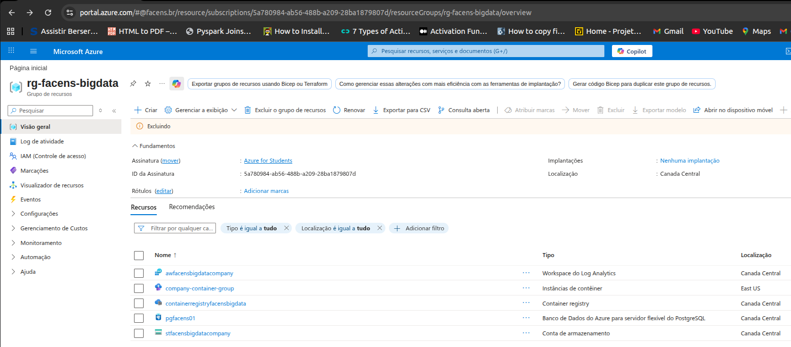

## Parte 8: Verificando a execução do container

### ENDPOINTS GET

### Execute  comando abaixo, copie a url desejada e acesse a url via navegador.
```bash
COMPANY_CONTAINER_REGISTRY_IP_ADDRESS=20.253.71.80
echo "endpoints GET"
echo http://$COMPANY_CONTAINER_REGISTRY_IP_ADDRESS:8000/departments/
echo http://$COMPANY_CONTAINER_REGISTRY_IP_ADDRESS:8000/jobs/
echo http://$COMPANY_CONTAINER_REGISTRY_IP_ADDRESS:8000/employees/
```
### Ou simplesmente modifique o IP nas url abaixo diretamente
http://135.237.75.169:8000/departments/

http://135.237.75.169:8000/jobs/

http://135.237.75.169:8000/employees/

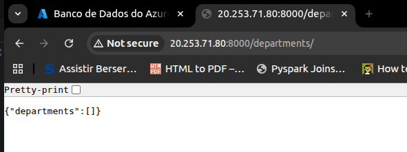


### ENDPOINTS POST

Para os endpoints post, é necessário usar alguma ferramenta de acesso adicional, como o POSTMAN, a lib python urlrequests ou o curl no linux 

### Endpoint post - execute  comando abaixo , como 
```bash
COMPANY_CONTAINER_REGISTRY_IP_ADDRESS=20.253.71.80
echo "endpoints POST - comando para execução"
curl -X POST "http://$COMPANY_CONTAINER_REGISTRY_IP_ADDRESS:8000/upload/departments/?file_path=/opt/files/departments.csv"

```

```bash
COMPANY_CONTAINER_REGISTRY_IP_ADDRESS=20.253.71.80
echo "endpoints POST - comando para execução"
curl -X POST "http://$COMPANY_CONTAINER_REGISTRY_IP_ADDRESS:8000/upload/jobs/?file_path=/opt/files/jobs.csv"

```

```bash
COMPANY_CONTAINER_REGISTRY_IP_ADDRESS=20.253.71.80
echo "endpoints POST - comando para execução"
curl -X POST "http://$COMPANY_CONTAINER_REGISTRY_IP_ADDRESS:8000/upload/hired_employees/?file_path=/opt/files/hired_employees.csv"

```

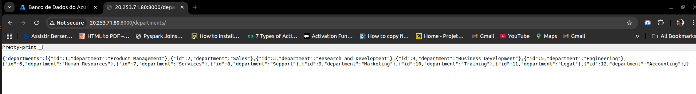


### ENDPOINTS POST

Abaixo temos a execução dos mesmos endpoint acima, mas agora, com um arquivo diferente, para simular uma atualização de dados ou adição de novos registros

### Endpoint post - execute  comando abaixo , como 
```bash
COMPANY_CONTAINER_REGISTRY_IP_ADDRESS=20.253.71.80
echo "endpoints POST - comando para execução"
curl -X POST "http://$COMPANY_CONTAINER_REGISTRY_IP_ADDRESS:8000/upload/departments/?file_path=/opt/files/departments_big_file.csv"

```

```bash
COMPANY_CONTAINER_REGISTRY_IP_ADDRESS=20.253.71.80
echo "endpoints POST - comando para execução"
curl -X POST "http://$COMPANY_CONTAINER_REGISTRY_IP_ADDRESS:8000/upload/jobs/?file_path=/opt/files/jobs_updated.csv"

```

```bash
COMPANY_CONTAINER_REGISTRY_IP_ADDRESS=20.253.71.80
echo "endpoints POST - comando para execução"
curl -X POST "http://$COMPANY_CONTAINER_REGISTRY_IP_ADDRESS:8000/upload/hired_employees/?file_path=/opt/files/hired_employees_updated.csv""

```

## Parte 9: Executando o container docker com a API localmente e usando o instancia de banco de dados gerenciada azure - postgres

### Somente apos criar o servidor postgres remote (Parte-4), banco de dados e tabelas 

```bash
COMPANY_PG_SERVER_NAME=pgfacens01
COMPANY_PG_USER=pgfacens
COMPANY_PG_PASSWORD=A12345678a
COMPANY_PG_BD_NAME=companydb
COMPANY_PG_PORT=5432
COMPANY_PG_HOST=pgfacens01.postgres.database.azure.com
```

### Criar a imagem e container localmente ##########

```bash
cd app
docker build -t company-api:latest .
```


### Variáveis utilizadas para a conexão do container docker local com a instância de banco de dados gerenciada azure - postgres

```bash
COMPANY_PG_SERVER_NAME=pgfacens01
COMPANY_PG_USER=pgfacens
COMPANY_PG_PASSWORD=A12345678a
COMPANY_PG_BD_NAME=companydb
COMPANY_PG_PORT=5432
COMPANY_PG_HOST=pgfacens01.postgres.database.azure.com
```

### Executando a imagem com o docker compose 
```bash
cd ..
docker compose up
```

### Verificando a api criada no container docker 


Abra uma aba no seu browser e verifique os endereços abaixo : 

http://localhost:8000/departments/

http://localhost:8000/jobs/

http://localhost:8000/employees/


### Carregando dados csv locais no banco utilizando a api de carga 
```bash
curl -X POST "http://localhost:8000/upload/departments/?file_path=/opt/files/departments.csv"
curl -X POST "http://localhost:8000/upload/jobs/?file_path=/opt/files/jobs.csv"
curl -X POST "http://localhost:8000/upload/hired_employees/?file_path=/opt/files/hired_employees.csv"
```

### Carregando alguns dados modificados e verificando o resultado da carga  
```bash
curl -X POST "http://localhost:8000/upload/jobs/?file_path=/opt/files/jobs_updated.csv"
curl -X POST "http://localhost:8000/upload/hired_employees/?file_path=/opt/files/hired_employees_updated.csv"
curl -X POST "http://localhost:8000/upload/departments/?file_path=/opt/files/departments_big_file.csv"
```

## Parte 10: Eliminando todos os itens criados no experimento, de uma única vez

### comando azure cli, para deletar o resource group criado, atenção, com essa ação todos os recurso, storage, maquinas virtuais e qualquer outro elemento criado nesse resource group, será eliminado e essa ação não pode ser revertida

```bash
az group delete --name $COMPANY_RESOURCE_GROUP  --yes --no-wait
```
